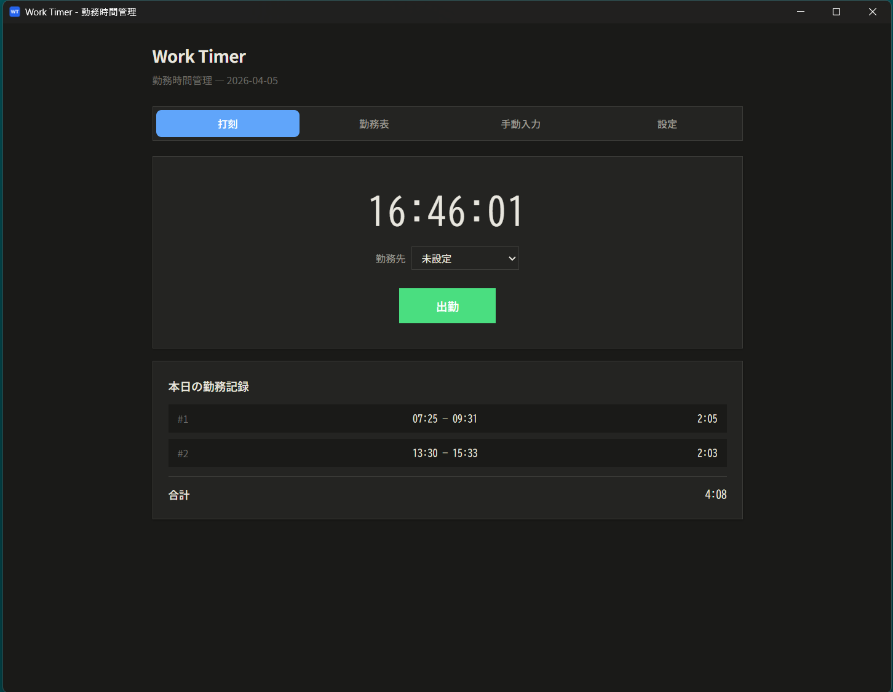

# Work Timer - 勤務時間管理アプリ

Tauri 2.x + React + TypeScript + SQLite で構築された勤務時間計測デスクトップアプリケーション。



## 機能

- **リアルタイム打刻**: 出勤/退勤ボタンでワンクリック記録
- **手動入力**: 日付・開始時刻・終了時刻を手入力で追加
- **日次管理**: 1日の複数セッション表示 + 合計時間
- **月次管理**: 月間の日別一覧 + 勤務日数・合計時間・平均時間
- **月次締め処理**: 月の最終日に締め操作を実行しロック
- **CSV出力**: Excel/スプレッドシート向けCSVエクスポート（日別明細 + 日別合計 + 月合計）
- **年次ダンプ**: 1年分のデータをJSONファイルとして出力

## 技術スタック

| レイヤー | 技術 |
|---------|------|
| フレームワーク | Tauri 2.x |
| フロントエンド | React 18 + TypeScript + Vite |
| バックエンド | Rust (Tauri commands) |
| データベース | SQLite (sqlx) |
| CSV処理 | csv crate (Rust) |

## 前提条件

- [Rust](https://www.rust-lang.org/tools/install) (1.77.2+)
- [Node.js](https://nodejs.org/) (18+)
- npm または pnpm
- OS固有の依存:
  - **Linux**: `sudo apt install libwebkit2gtk-4.1-dev build-essential curl wget file libxdo-dev libssl-dev libayatana-appindicator3-dev librsvg2-dev`
  - **macOS**: Xcode Command Line Tools
  - **Windows**: Visual Studio Build Tools, WebView2

## セットアップ

```bash
# 依存パッケージのインストール
npm install

# 開発モードで起動
npm run tauri dev

# プロダクションビルド
npm run tauri build
```


## プロジェクト構成

```
work-timer/
├── index.html              # Viteエントリ
├── package.json
├── vite.config.ts
├── tsconfig.json
├── prototype.html          # スタンドアロンUIプロトタイプ
├── src/
│   ├── main.tsx            # Reactエントリ
│   ├── App.tsx             # メインApp（タブナビゲーション）
│   ├── index.css           # グローバルCSS
│   ├── types/
│   │   └── index.ts        # TypeScript型定義
│   ├── lib/
│   │   └── api.ts          # Tauri invokeラッパー
│   └── components/
│       ├── TimerView.tsx    # 打刻・記録画面
│       ├── MonthlyView.tsx  # 月次管理画面
│       └── SettingsView.tsx # 設定・年次ダンプ画面
└── src-tauri/
    ├── Cargo.toml
    ├── tauri.conf.json
    ├── build.rs
    ├── capabilities/
    │   └── default.json
    ├── migrations/
    │   └── 001_init.sql    # DBスキーマ
    └── src/
        ├── lib.rs          # Rustバックエンド（DB・全コマンド）
        └── main.rs         # Tauriエントリポイント
```

## データベーススキーマ

### work_entries（勤務記録）

| カラム | 型 | 説明 |
|--------|------|------|
| id | INTEGER PK | 自動採番 |
| work_date | TEXT | 勤務日 (YYYY-MM-DD) |
| start_time | TEXT | 開始時刻 (HH:MM:SS) |
| end_time | TEXT? | 終了時刻（NULLなら勤務中） |
| duration_minutes | INTEGER | 勤務時間（分） |
| note | TEXT | メモ |

### monthly_closes（月次締め）

| カラム | 型 | 説明 |
|--------|------|------|
| year_month | TEXT UNIQUE | 対象年月 (YYYY-MM) |
| closed_at | TEXT | 締め処理日時 |
| total_minutes | INTEGER | 月合計（分） |
| working_days | INTEGER | 勤務日数 |

## CSVフォーマット

出力されるCSVは以下の構造です:

```
日付,開始時刻,終了時刻,勤務時間(分),勤務時間,メモ
2026-03-01,09:00:00,12:00:00,180,3:00,午前勤務
2026-03-01,13:00:00,18:00:00,300,5:00,午後勤務
...

--- 日別合計 ---
2026-03-01,,,480,8:00,
2026-03-02,,,420,7:00,
...

月合計 (2026-03),,,3600,60:00,勤務日数: 20日
```

Google スプレッドシートにそのままインポート可能です（UTF-8 BOM付き）。

## ライセンス

MIT
